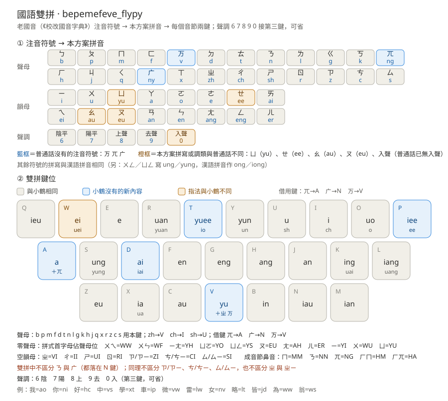

# 老國音小鶴雙拼 · bepemefeve_flypy

> 沿用小鶴雙拼的基本鍵位，並略加調整，用**兩個鍵**打出老國音（《校改國音字典》）裏的任何一個音節。



- **方案代碼**：`bepemefeve_flypy`
- **字表**：沿用 [`bepemefeve`](https://github.com/baopaau/rime-bepemefe)（老國音注音字音表，59,474 條 / 44,518 字頭），**無需改動任何碼表**
- **適用**：Rime 系輸入法（小狼毫 Weasel / 鼠鬚管 Squirrel / Trime / fcitx-rime 等）

---

## 目錄

1. [這個方案是什麼](#一這個方案是什麼)
2. [先說清楚：本方案用的「老國音拼音」](#二先說清楚本方案用的老國音拼音)
3. [雙拼鍵位](#三雙拼鍵位)
4. [與小鶴雙拼的差異（遷移要點）](#四與小鶴雙拼的差異遷移要點)
5. [快速上手](#五快速上手)
6. [安裝](#六安裝)
7. [已知取捨：同碼的音節](#七已知取捨同碼的音節)
8. [數據與致謝](#八數據與致謝)

---

## 一、這個方案是什麼

老國音是 1913–1932 年間由中華民國教育部頒行、以《校改國音字典》為準的讀音系統。它與今天的普通話（新國音）差別不小：

- **分尖團**：尖音讀 ㄗㄧ／ㄘㄧ／ㄙㄧ，團音讀 ㄐ／ㄑ／ㄒ（尖：ㄗㄧㄢ，團：ㄐㄧㄢ）
- **有疑母 ㄫ、娘母 ㄬ、微母 ㄪ**三個普通話已經沒有的聲母（我＝ㄫㄛ，女＝ㄬㄩ，微＝ㄪㄟ）
- **保留入聲**，是獨立的第五個聲調（汁＝ㄓ˙）
- **保留 ㄧㄞ、ㄧㄛ 等韻**，ㄝ 可獨立成韻（ㄔㄝ 車、ㄒㄧㄛ 學）

本方案讓你沿用**小鶴雙拼的鍵位習慣**，把這些音節全部用兩鍵打出來。字表裏 1,826 個注音串、535 個不計調音節，**全部恰好兩鍵**（第三鍵可選打聲調）。

---

## 二、先說清楚：本方案用的「老國音拼音」

### 2.1 為什麼要有一套拼音

字表以**注音符號**記錄讀音（如 `ㄓㄨㄥ`、`ㄬㄧㄛ˙`）。雙拼需要把音節拆成「聲母 + 韻母」兩段並各給一個鍵，因此先把注音轉寫成拉丁拼式——這套轉寫基於[老國音衆多拼音](https://github.com/baopaau/rime-bepemefeve)方案，並自己做了調整。

### 2.2 注音符號 → 拼音　對應表

**聲母（24）**

| 注音 | ㄅ | ㄆ | ㄇ | ㄈ | ㄪ | ㄉ | ㄊ | ㄋ | ㄌ | ㄍ | ㄎ | ㄫ |
|---|---|---|---|---|---|---|---|---|---|---|---|---|
| 拼音 | b | p | m | f | **v** | d | t | n | l | g | k | **ng** |

| 注音 | ㄏ | ㄐ | ㄑ | ㄬ | ㄒ | ㄓ | ㄔ | ㄕ | ㄖ | ㄗ | ㄘ | ㄙ |
|---|---|---|---|---|---|---|---|---|---|---|---|---|
| 拼音 | h | j | q | **ny** | x | zh | ch | sh | r | z | c | s |

**韻母（16）**

| 注音 | ㄧ | ㄨ | ㄩ | ㄚ | ㄛ | ㄜ | ㄝ | ㄞ | ㄟ | ㄠ | ㄡ | ㄢ | ㄣ | ㄤ | ㄥ | ㄦ |
|---|---|---|---|---|---|---|---|---|---|---|---|---|---|---|---|---|
| 拼音 | i | u | **yu** | a | o | e | **ee** | ai | ei | **au** | **eu** | an | en | ang | eng | er |

**聲調（5）**

| 聲調 | 陰平 | 陽平 | 上聲 | 去聲 | 入聲 |
|---|---|---|---|---|---|
| 符號 | （不加） | ˊ | ˇ | ˋ | ˙ |
| 鍵 | **6** | **7** | **8** | **9** | **0** |

### 2.3 拼寫規則（與漢語拼音不同之處）

| 規則 | 說明 | 例 |
|---|---|---|
| ㄩ 一律寫 `yu` | 漢語拼音的 ü 在注音是 ㄩ | ㄌㄩ＝`lyu`、ㄐㄩ＝`jyu`、ㄩ＝`yu` |
| ㄝ 寫 `ee` | 獨立成韻時 | ㄔㄝ＝`chee`、ㄧㄝ＝`iee` |
| ㄠ／ㄡ 寫 `au`／`eu` | 不寫 ao／ou | ㄍㄠ＝`gau`、ㄍㄡ＝`geu` |
| ㄨㄥ／ㄩㄥ 寫 `ung`／`yung` | 不寫 ong／iong | ㄓㄨㄥ＝`zhung`、ㄒㄩㄥ＝`xyung` |
| 零聲母用 y／w | 與漢語拼音同 | ㄧ＝`yi`、ㄨ＝`wu`、ㄧㄚ＝`ya`、ㄨㄚ＝`wa` |
| ㄧㄣ／ㄨㄣ／ㄩㄣ 去掉 e | ien→in、uen→un、yuen→yun | ㄒㄧㄣ＝`xin`、ㄉㄨㄣ＝`dun`、ㄐㄩㄣ＝`jyun` |
| 空韻母補 i | ㄓ／ㄗ 等單用時 | ㄓ＝`zhi`、ㄗ＝`zi` |
| 尖音 ㄗㄧ 寫 `zyi` | 為與 ㄗ（`zi`）區分 | ㄗㄧ＝`zyi`、ㄙㄧㄢ＝`sian` |
| 入聲標在字尾 | ˙ 附於音節之後 | 汁＝`ㄓ˙`＝`zhi`（入聲） |

**可選的簡化拼式**（方案本身允許的變體，不影響雙拼鍵位）：`ee→e`（yuee→yue）、`ieu→iu`、`uei→ui`、`wun→wen`、`jiai/qiai/xiai→jai/qai/xai`、`ny→n`、`nga/nge/ngo→a/e/o`、`er→r`，以及**不打聲調**。

### 2.4 拼式一覽（幾個例子）

| 字 | 注音 | 老國音拼音 | 普通話 | 差別 |
|---|---|---|---|---|
| 我 | ㄫㄛ | `ngo` | wǒ | 疑母 ㄫ |
| 女 | ㄬㄩ | `nyu` | nǚ | 娘母 ㄬ |
| 微 | ㄪㄟ | `vei` | wēi | 微母 ㄪ |
| 尖 | ㄗㄧㄢ | `zian` | jiān | 尖音 |
| 學 | ㄒㄧㄛ | `xio` | xué | 入聲藥韻 |
| 車 | ㄔㄝ | `chee` | chē | 車遮韻 |
| 哥 | ㄍㄛ | `go` | gē | 歌韻讀 o |
| 雷 | ㄌㄨㄟ | `luei` | léi | 微韻合口 |
| 森 | ㄕㄣ | `shen` | sēn | 審母 |
| 中 | ㄓㄨㄥ | `zhung` | zhōng | ung 拼法 |
| 直 | ㄓ˙ | `zhi`（入） | zhí | 入聲獨立 |

---

## 三、雙拼鍵位

二十六個字母鍵，一鍵一韻母（同鍵的幾個韻母與小鶴一樣，靠聲母自然區分）：

| 鍵 | 韻母 | 鍵 | 韻母 | 鍵 | 韻母 |
|---|---|---|---|---|---|
| **Q** | ieu | **A** | a（**＋ㄫ 的聲母鍵**） | **Z** | eu |
| **W** | ei／uei | **S** | ung／yung | **X** | ia／ua |
| **E** | e | **D** | ai／iai | **C** | au |
| **R** | uan／yuan | **F** | en | **V** | yu（**＋ㄓ、ㄪ 的聲母鍵**） |
| **T** | yuee／io | **G** | eng | **B** | in |
| **Y** | yun／un | **H** | ang | **N** | iau（**＋ㄬ 的聲母鍵**） |
| **U** | u | **J** | an | **M** | ian |
| **I** | i | **K** | ing／uai | | |
| **O** | uo／o | **L** | iang／uang | | |
| **P** | iee／ee | | | | |

**聲母**：`b p m f d t n l g k h j q x r z c s` 用本鍵；`zh→V`、`ch→I`、`sh→U`；三個老國音特有的聲母借鍵：**ㄫ(ng)→A**、**ㄬ(ny)→N**、**ㄪ(v)→V**（它們能配的韻母與同鍵的聲母不衝突）。

**零聲母**：拼式的首字母佔聲母位，其餘按韻母鍵。

| 音節 | 碼 | 音節 | 碼 | 音節 | 碼 |
|---|---|---|---|---|---|
| ㄚ | **AA** | ㄧ | **YI** | ㄨ | **WU** |
| ㄛ | **OO** | ㄧㄚ | **YA** | ㄨㄚ | **WA** |
| ㄜ | **EE** | ㄧㄝ | **YP** | ㄨㄛ | **WO** |
| ㄝ | **EE** | ㄧㄞ | **YD** | ㄨㄞ | **WD** |
| ㄞ | **AI** | ㄧㄠ | **YC** | ㄨㄟ | **WW** |
| ㄟ | **EI** | ㄧㄡ | **YZ** | ㄨㄢ | **WJ** |
| ㄠ | **AU** | ㄧㄢ | **YJ** | ㄨㄣ | **WF** |
| ㄡ | **EU** | ㄧㄣ | **YB** | ㄨㄤ | **WH** |
| ㄢ | **AN** | ㄧㄤ | **YH** | ㄨㄥ | **WS** |
| ㄣ | **EN** | ㄧㄥ | **YK** | ㄩ | **YU** |
| ㄤ | **AH** | ㄦ | **ER** | ㄩㄝ | **YT** |
| ㄥ | **EG** | | | ㄩㄛ | **YO** |
| | | | | ㄩㄢ | **YR** |
| | | | | ㄩㄣ | **YY** |
| | | | | ㄩㄥ | **YS** |

**空韻母**：ㄓ＝**VI**、ㄔ＝**II**、ㄕ＝**UI**、ㄖ＝**RI**；ㄗ／ㄗㄧ 同作 **ZI**，ㄘ／ㄘㄧ 同作 **CI**，ㄙ／ㄙㄧ 同作 **SI**（尖音與空韻母刻意不合併鍵位以外的區分）。

**成音節鼻音**：ㄇ＝**MM**、ㄋ＝**NN**、ㄫ＝**NG**、ㄏㄇ＝**HM**、ㄏㄫ＝**HA**；ㄨㄧㄥ＝**WK**（罕見）。

**聲調**：接在第三鍵，**可省略**。例：知＝`vi6`，也可只打 `vi`；汁＝`vi0`（入聲）。

---

## 四、與小鶴雙拼的差異（遷移要點）

已經在用**小鶴雙拼**的人，只需要記住下面幾條：

**① 手指完全一樣的（絕大多數）**：a o e i u、ai ei an en ang eng in ing、ia ua iang uang ing uai、uan、ian、iao、ie、ieu、ei、en、eng、ang、an、ai、ue、er、uo……

**② 手指不同的一處**：
- `uei（ui）`：小鶴在 **V**，本方案在 **W**（對＝`dw`，會＝`hw`，最＝`zw`）。

**③ 小鶴沒有、本方案新增的**：
- 三個借鍵聲母：**ㄫ→A**（我＝`ao`／岸＝`aj`）、**ㄬ→N**（你＝`ni`、年＝`nm`）、**ㄪ→V**（微＝`vw`）；**雙拼中不區分 ㄋ 與 ㄬ**，兩者都落 N 鍵
- 三個新韻母：**io→T**（略＝`lt`）、**iai→D**（皆＝`jd`）、**ㄝ獨立→P**（車＝`ip`）
- 尖音與空韻母：**ㄗ／ㄗㄧ＝ZI**、**ㄘ／ㄘㄧ＝CI**、**ㄙ／ㄙㄧ＝SI**（小鶴的 zi 就是 ZI，直接可用）

**④ 拼寫變了但手指不變（不用改指法）**：小鶴把 ao 拼 `ao`、ong 拼 `ong`、ü 拼 `ü`；本方案寫作 `au`、`ung`、`yu`——**鍵位相同**，只是老國音記法如此。

---

## 五、快速上手

| 字 | 注音 | 碼 | 字 | 注音 | 碼 |
|---|---|---|---|---|---|
| 我 | ㄫㄛ | `ao` | 學 | ㄒㄧㄛ | `xt` |
| 你 | ㄋㄧ | `ni` | 車 | ㄔㄝ | `ip` |
| 好 | ㄏㄠ | `hc` | 微 | ㄪㄟ | `vw` |
| 中 | ㄓㄨㄥ | `vs` | 雷 | ㄌㄨㄟ | `lw` |
| 國 | ㄍㄨㄛ | `go` | 女 | ㄬㄩ | `nv` |
| 天 | ㄊㄧㄢ | `tm` | 略 | ㄌㄧㄛ | `lt` |
| 心 | ㄙㄧㄣ | `sb` | 皆 | ㄐㄧㄞ | `jd` |
| 山 | ㄕㄢ | `uj` | 為 | ㄨㄟ | `ww` |
| 人 | ㄖㄣ | `rf` | 翁 | ㄨㄥ | `ws` |
| 知 | ㄓ | `vi` | 魚 | ㄩ | `yu` |

想打聲調就再接一鍵：`hc8`＝好（上聲）、`vi0`＝汁（入聲）。

---

## 六、安裝

1. 把下列文件放進 Rime 用戶目錄
   - Windows（小狼毫）：`%APPDATA%\Rime`
   - macOS（鼠鬚管）：`~/Library/Rime`
   - Linux：`~/.config/ibus/rime` 或 `~/.local/share/fcitx5/rime`

   ```
   bepemefeve_flypy.schema.yaml
   bepemefeve.dict.yaml
   bepemefeve.phrase.dict.yaml
   symbols_wu.yaml
   ```

2. 在 `default.custom.yaml` 裏掛上方案：

   ```yaml
   patch:
     schema_list:
       - schema: bepemefeve_flypy
       # 其他方案照樣往下追加即可
   ```

3. 重新部署（小狼毫：右鍵托盤圖標 →「重新部署」）。

---

## 七、已知取捨：同碼的音節

老國音的音節數比普通話多（535 vs 403），二十六個鍵不夠一一對應，因此有 **63 組同碼**（同碼只影響候選多寡，不影響出字）。最需要注意的是：

| 鍵碼 | 同碼雙方 | 例 |
|---|---|---|
| **O** | ㄛ（歌韻）與 ㄨㄛ | 哥／鍋、科／闊、呵／火、多／舵、牠／妥、着／桌、搓／錯、索／梭、左／坐、羅／騾、若／弱、說／芍、戳／齪 |
| **T** | ㄩㄝ 與 ㄧㄛ | 決／腳、靴／學、缺／確、劣／略、雪／削、絕／爵 |
| **Y／R** | 撮口 ㄩㄣ／ㄩㄢ 與 合口 ㄨㄣ／ㄨㄢ | 旬／孫、俊／尊、宣／酸、戀／亂 |
| **W** | ㄟ 與 ㄨㄟ | 嘿／會、給／貴、擂／雷 |
| **N** | ㄬ 與 ㄋ | 尼／泥、年／拈 |
| **ZI／CI／SI** | ㄗ／ㄗㄧ 等 | 子／劑、雌／妻、絲／西 |
| **VI** | ㄓ 與 ㄓㄧ | （拼式本身同作 zhi） |

此外，少數音節在**零聲母**時同碼：ㄧㄛ／ㄩㄛ 同作 `yo`；ㄚ／ㄫㄚ 同作 `aa`；ㄜ／ㄝ 同作 `ee`；ㄤ／ㄫㄤ 同作 `ah`；ㄏㄚ／ㄏㄫ 同作 `ha`。

---

## 八、數據與致謝

**字表規模**：59,474 條 ／ 44,518 字頭 ／ 1,826 個注音串 ／ 535 個不計調音節 ／ 24 聲母 ＋ 零聲母 ／ 44 韻母 ／ 5 聲調。其中尖團對立 5,158 字、疑母 ㄫ 218 字、娘母 ㄬ 384 字、入聲 6,831 字（在普通話裏分派爲去聲 49%、陽平 32%、陰平 14%、上聲 5%）。

**驗證**：本方案 schema 的拼音轉寫與壓鍵規則，已對字表全部 1,826 個注音串逐條跑通——**全部兩鍵、零例外**。

**致謝**

- [bepemefeve 老國音注音字音表兼 RIME 輸入方案整合](https://github.com/baopaau/rime-bepemefeve)（抱豹）——字表、注音碼表，及其所彙集的老國音諸家拼音方案
- [小鶴雙拼](https://github.com/rime/rime-double-pinyin)（鶴／佛振）——鍵位設計
- 電子化《校改國音字典》《學生字典》《國音新詩韻》、維基學院老國音審音字庫等字音數據來源（詳見 `bepemefeve.dict.yaml` 卷首）

**作者**：雪螢 <siqyin@qq.com>

---

## 授權

方案配置（`bepemefeve_flypy.schema.yaml`、`keymap.svg`、本說明）可自由使用、修改、再分發。其中的字表 `bepemefeve.dict.yaml`、`bepemefeve.phrase.dict.yaml`、`symbols_wu.yaml` 來自上游項目，版權與授權請遵循原項目說明。
